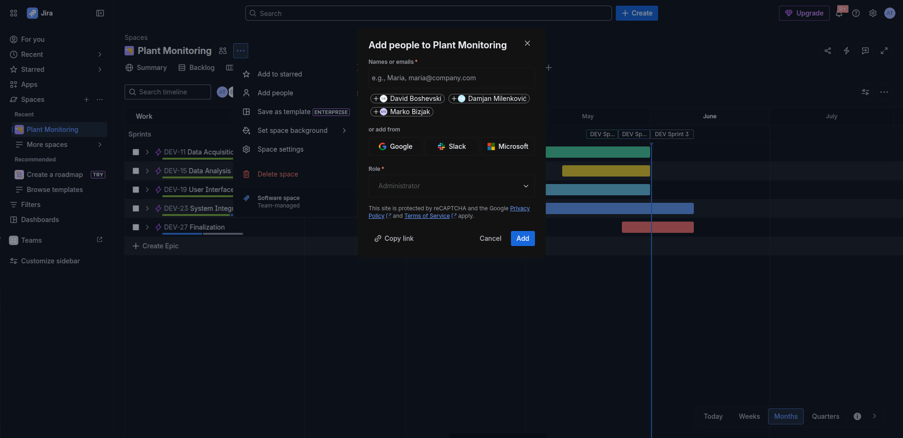
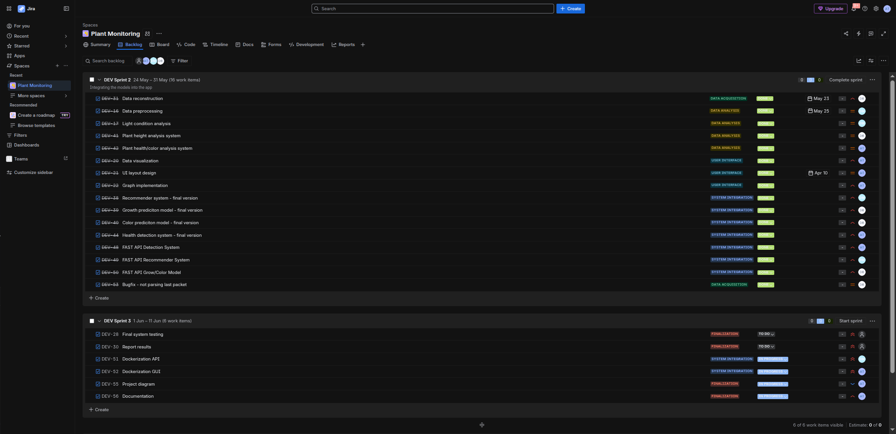
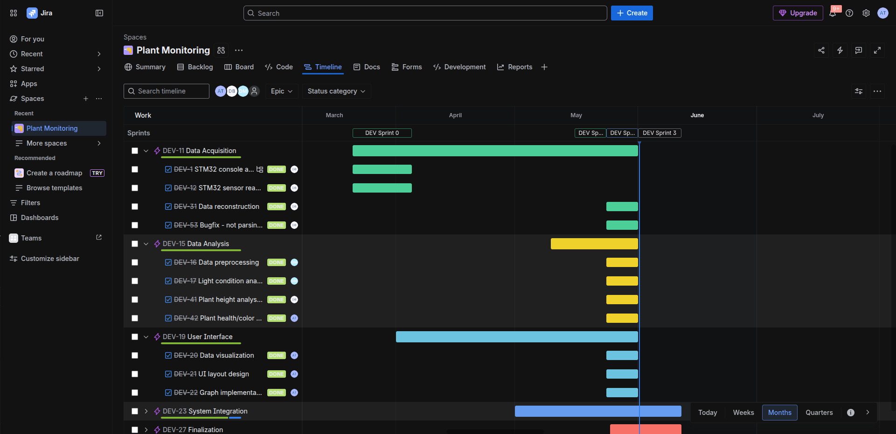
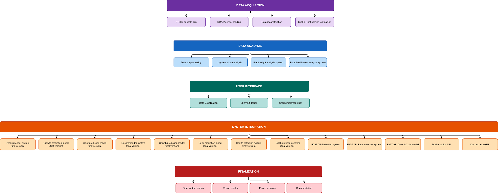

# Sistem za spremljanje in analizo svetlobnih razmer za zdravje rastlin

**Načrt projektnega dela in spremljanje razvoja študentskega projekta**

**Skupina:** Anastasija Temova, David Boshevski, Damjan Milenković
**Mentor:** Marko Bizjak

---

## 1. Vzpostavitev projekta

Za sistematično in učinkovito vodenje projekta smo uporabili orodje Jira, ki omogoča strukturirano upravljanje z opravili, sodelovanje članov ekipe ter sprotno spremljanje napredka. Izbira tega orodja temelji na njegovi široki uporabi v industriji, podpori agilnim metodologijam ter enostavni dostopnosti za manjše projektne skupine. Jira prav tako ne zahteva nove namestitve na določenem spletnem strežniku in je brezplačna za manjše skupine.

Vodja mikroskupine je inicializiral projektno okolje z ustvarjanjem uporabniškega računa. Po uspešni registraciji je v nadzorni plošči povabil preostale člane mikroskupine prek možnosti **Invite a teammate**, kot je prikazano na Sliki 1. Preostali člani so dokončali registracijo in pridobili dostop do projektnega okolja.

V naslednjem koraku je vodja mikroskupine ustvaril nov projekt z imenom **Sistem za spremljanje in analizo svetlobnih razmer za zdravje rastlin**. Med kreiranjem novega projekta smo izbrali predlogo **Scrum** ter ekipno voden projekt **Team-managed**, ki zagotavlja večjo fleksibilnost pri prilagajanju strukture projekta glede na potrebe ekipe.

Po uspešno ustvarjenem projektu je vodja projekta dodal preostale člane mikroskupine (David Boshevski, Damjan Milenković) in mentorja mikroskupine (Marko Bizjak).

---

## 2. Vloge ter sklopi in cilji projekta

### 2.1 Opredelitev ciljev projekta

Primarni cilj projekta je razvoj integriranega sistema za spremljanje svetlobnih razmer v okolju rastlin ter analiza njihovega vpliva na rast in zdravje rastlin. Sistem mora omogočati:

- zajem svetlobnih podatkov (intenziteta, trajanje, spekter) prek senzorjev STM32,
- shranjevanje in obdelavo zajetih podatkov,
- analizo optimalnih pogojev za rast ter zaznavanje odstopanj,
- vizualizacijo rezultatov za končnega uporabnika prek grafičnega vmesnika,
- napovedovanje rasti in zdravstvenega stanja rastlin s pomočjo modelov strojnega učenja.

Tak sistem ima praktično vrednost predvsem v pametnem kmetijstvu in avtomatiziranih rastlinjakih.

### 2.2 Delovni sklopi (Epics)

Projekt smo razdelili na pet logično ločenih delovnih sklopov. Za vsak delovni sklop je določena odgovorna oseba (Assignee), ki vodi sklop; pri posameznih opravilih sodelujejo tudi drugi člani. Delovni sklopi se postopoma zaključujejo in ne trajajo celotne dobe študentskega projekta, kot je razvidno na Sliki 2.

| Delovni sklop (Epic) | Odgovorna oseba | Opis |
|---|---|---|
| DEV-11 Data Acquisition | David Boshevski | Zajem svetlobnih podatkov prek senzorjev STM32, kalibracija senzorjev, shranjevanje podatkov. |
| DEV-15 Data Analysis | Vsi člani | Obdelava podatkov, analiza svetlobnih razmer, zaznavanje odstopanj, analiza višine in zdravja rastlin. |
| DEV-19 User Interface | Anastasija Temova | Grafični vmesnik za prikaz podatkov, vizualizacija meritev in rezultatov analiz, svetla in temna tema. |
| DEV-23 System Integration | Vsi člani | Integracija komponent, priporočilni sistem, modeli za napoved rasti in barve, zaznavanje zdravja, API in kontejnerizacija. |
| DEV-27 Finalization | Vsi člani | Končno testiranje sistema, priprava diagramov in dokumentacije, odpravljanje napak. |

### 2.3 Opravila (Stories)

Vsak član mikroskupine je za svoje delovne sklope ustvaril nova opravila. Opravila smo ustvarili v roku treh tednov po začetku izvedbe študentskega projekta. Skozi razvoj projekta se opravila sproti dopolnjujejo. Statusi spodaj odražajo trenutno stanje na Jira deski.

#### DEV-11 Data Acquisition

| ID | Opravilo | Status | Odgovorna oseba |
|---|---|---|---|
| DEV-1 | STM32 console application | Done | David Boshevski |
| DEV-12 | STM32 sensor reading | Done | David Boshevski |
| DEV-31 | Data reconstruction | Done | David Boshevski |
| DEV-53 | Bugfix — not parsing last packet | Done | David Boshevski |

#### DEV-15 Data Analysis

| ID | Opravilo | Status | Odgovorna oseba |
|---|---|---|---|
| DEV-16 | Data preprocessing | Done | Damjan Milenković |
| DEV-17 | Light condition analysis | Done | Damjan Milenković |
| DEV-41 | Plant height analysis | Done | David Boshevski |
| DEV-42 | Plant health/color analysis | Done | Anastasija Temova |

#### DEV-19 User Interface

| ID | Opravilo | Status | Odgovorna oseba |
|---|---|---|---|
| DEV-20 | Data visualization | Done | Anastasija Temova |
| DEV-21 | UI layout design | Done | Anastasija Temova |
| DEV-22 | Graph implementation | Done | Anastasija Temova |
| DEV-60 | Implement dark/light theme | Done | Anastasija Temova |

#### DEV-23 System Integration

| ID | Opravilo | Status | Odgovorna oseba |
|---|---|---|---|
| DEV-25 | Recommender system - first version | Done | Damjan Milenković |
| DEV-32 | Growth prediction model - first version | Done | David Boshevski |
| DEV-33 | Color prediction model - first version | Done | David Boshevski |
| DEV-38 | Recommender system - final version | Done | Damjan Milenković |
| DEV-39 | Growth prediction model - final version | Done | David Boshevski |
| DEV-40 | Color prediction model - final version | Done | David Boshevski |
| DEV-43 | Health detection system - first version | Done | Anastasija Temova |
| DEV-44 | Health detection system - final version | Done | Anastasija Temova |
| DEV-48 | FAST API Detection | Done | Anastasija Temova |
| DEV-49 | FAST API Recommendation | Done | Damjan Milenković |
| DEV-50 | FAST API Growth/Color | Done | David Boshevski |
| DEV-51 | Dockerization API | Done | Damjan Milenković |
| DEV-52 | Dockerization GUI | Done | Anastasija Temova |

#### DEV-27 Finalization

| ID | Opravilo | Status | Odgovorna oseba |
|---|---|---|---|
| DEV-28 | Final system testing | Done | David Boshevski |
| DEV-30 | Report results | Done | Damjan Milenković |
| DEV-55 | Project diagrams | Done | Anastasija Temova |
| DEV-56 | Documentation | Done | Anastasija Temova |
| DEV-58 | Code structure cleanup | Done | Anastasija Temova |
| DEV-59 | BugFix — TclError "bad screen distance" | Done | Anastasija Temova |

---

## 3. Izvajanje in vodenje projekta

### 3.1 Pristop Scrum in sprinti

Projekt izvajamo po metodologiji **Scrum**, ki temelji na iterativnem razvoju. Delo je razdeljeno na sprinte, ki trajajo največ en mesec. Sprinti se nastavljajo v zavihku **Backlog** orodja Jira.

| Sprint | Obdobje | Vsebina |
|---|---|---|
| DEV Sprint 0 | 21. marec — 4. april | Data Acquisition, začetek User Interface |
| DEV Sprint 1 | 16. maj — 23. maj | Data Acquisition, Data Analysis, User Interface, začetek System Integration |
| DEV Sprint 2 | 24. maj — 31. maj | System Integration |
| DEV Sprint 3 | 1. junij — 11. junij | System Integration (kontejnerizacija), Finalization |

### 3.2 Podopravila (Subtasks)

Opravila (Stories) smo zasnovali dovolj granularno, da je vsako lahko izvedla ena oseba v okviru enega tedna, zato ločenih podopravil (Subtasks) v večini primerov nismo ustvarjali. V skladu z agilnim pristopom smo presodili, da bi dodatna razdelite v tako majhne enote povečala administrativno breme brez dodane vrednosti. Vsako opravilo je bilo dodeljeno točno eni osebi in je imelo jasno določen obseg dela ter status, kar je omogočalo pregledno sledenje napredku. Pri obsežnejših opravilih (npr. integracijska opravila in opravila tipa Bug) smo delo po potrebi razdelili na ločena opravila ter med njimi vzpostavili vsebinske odvisnosti.

### 3.3 Spremljanje napredka

Napredek projekta spremljamo prek statusov v Jiri:

- **To Do** — opravilo še ni začeto,
- **In Progress** — opravilo se izvaja,
- **Done** — opravilo je zaključeno in dokumentirano.

Člani med razvojem status svojih opravil sproti posodabljajo.

### 3.4 Upravljanje napak (Bug tracking)

V primeru zaznanih napak ustvarimo opravila tipa **Bug**. Primera sta **DEV-53 Bugfix — not parsing last packet** in **DEV-59 BugFix — TclError "bad screen distance"** (oba zaključena). Dokončanih podopravil, opravil in delovnih sklopov ne brišemo — označimo jih kot dokončane.

### 3.5 Komunikacija in koordinacija

Projektna skupina izvaja redne tedenske sestanke, kjer pregledamo napredek, razdelimo naloge ter identificiramo in rešujemo težave. Na sestankih se trenutno aktualna opravila razdelijo med člane glede na njihove trenutne zmožnosti.

---

## 4. Hierarhija delovnih sklopov in opravil

Spodnji diagram prikazuje celotno hierarhijo delovnih sklopov (Epics) in opravil (Stories) v projektu.

---

## 5. Povzetek izvedenih del po članih

### Anastasija Temova

Odgovorna za uporabniški vmesnik in zaznavanje zdravja rastlin. Izvedena opravila:

- celoten grafični vmesnik (Tkinter): vizualizacija podatkov, postavitev vmesnika, grafi (DEV-20, DEV-21, DEV-22),
- svetla in temna tema vmesnika (DEV-60),
- analiza zdravja in barve rastlin (DEV-42),
- sistem za zaznavanje zdravja rastlin in njegova integracija (DEV-43, DEV-44),
- FastAPI vmesnik za zaznavanje (DEV-48),
- kontejnerizacija grafičnega vmesnika (DEV-52, v teku),
- diagrami projekta in dokumentacija (DEV-55, DEV-56, v teku),
- čiščenje strukture kode in odprava napak (DEV-58, DEV-59).

### David Boshevski

Odgovoren za zajem podatkov in napovedne modele. Izvedena opravila:

- konzolna aplikacija in branje senzorjev na STM32 (DEV-1, DEV-12),
- rekonstrukcija podatkov in odprava napake pri razčlenjevanju (DEV-31, DEV-53),
- analiza višine rastline (DEV-41),
- modela za napoved rasti in barve ter njuna integracija (DEV-32, DEV-33, DEV-39, DEV-40),
- FastAPI vmesnik za napoved rasti in barve (DEV-50),
- končno testiranje sistema (DEV-28, v načrtu).

### Damjan Milenković

Odgovoren za predobdelavo in analizo podatkov ter priporočilni sistem. Izvedena opravila:

- predobdelava podatkov in analiza svetlobnih razmer (DEV-16, DEV-17),
- priporočilni sistem in njegova integracija (DEV-25, DEV-38),
- FastAPI vmesnik za priporočila (DEV-49),
- kontejnerizacija API-ja (DEV-51, v teku),
- priprava rezultatov poročila (DEV-30, v načrtu).

---

## 6. Zaključek

Z uporabo orodja Jira in agilne metodologije Scrum smo vzpostavili učinkovit sistem vodenja projekta. Strukturiran pristop z uporabo delovnih sklopov in opravil je omogočil postopno gradnjo sistema. Vse ključne funkcionalnosti (zajem podatkov, analiza, grafični vmesnik, napovedni modeli, zaznavanje zdravja in API-ji) so implementirane in integrirane. V zaključni fazi ostajajo še opravila iz sklopa Finalization (končno testiranje, dokumentacija) ter kontejnerizacija, ki se izvajajo proti koncu semestra.

Ob zaključku projekta je pripravljen povzetek izvedenih del vsakega člana mikroskupine (poglavje 5).

---

*Zadnja posodobitev: junij 2025*