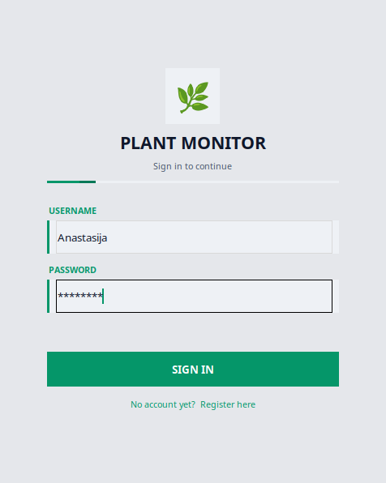
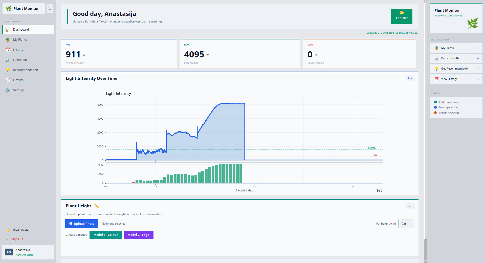
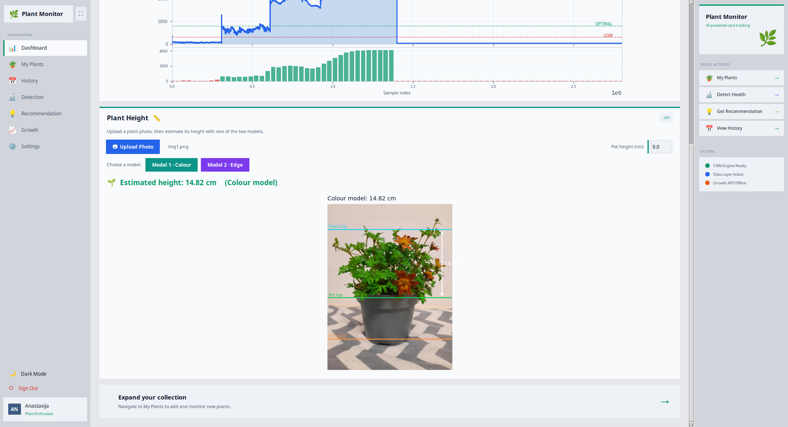
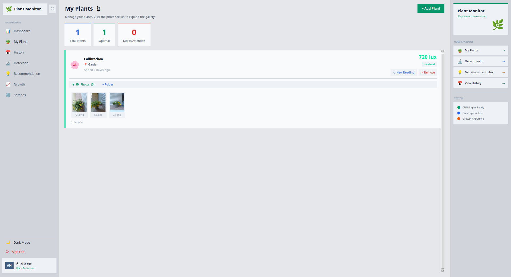
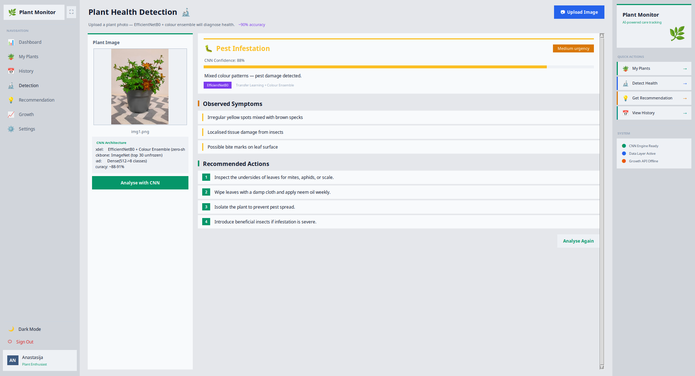
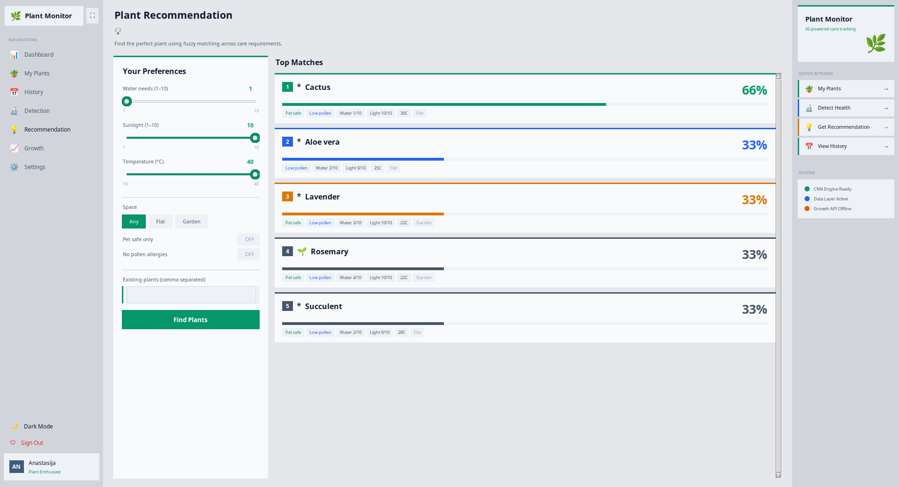
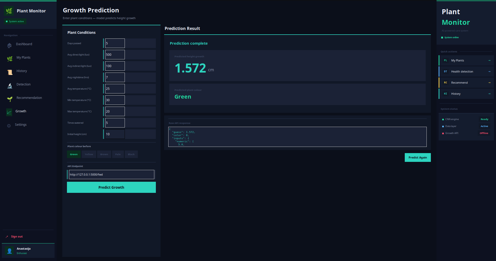

# Sistem za spremljanje in analizo svetlobnih razmer za zdravje rastlin

**Zaključna dokumentacija — GitHub Wiki**

**Skupina:** Anastasija Temova, David Boshevski, Damjan Milenković
**Mentor:** Marko Bizjak

---

## 1. Projektne specifikacije

### 1.1 Namen projekta in skupine uporabnikov

Sistem za spremljanje in analizo svetlobnih razmer za zdravje rastlin je programska rešitev, ki omogoča zaznavanje, beleženje in analizo svetlobnih razmer v okolju, kjer rastline rastejo. Namen sistema je pomagati uporabnikom pri vzpostavitvi optimalnih svetlobnih pogojev za rast in zdravje rastlin, zgodaj zaznati morebitne probleme ter z vizualizacijo podatkov olajšati sprejemanje odločitev pri negi rastlin.

Sistem naslavlja naslednje skupine uporabnikov in njihove potrebe:

| Skupina uporabnikov | Potrebe in primeri uporabe |
|---|---|
| **Ljubitelji rastlin (domači uporabniki)** | Želijo enostavno slediti svetlobnim razmeram svojih lončnic in sobnih rastlin ter prepoznati neustrezne pogoje. Potrebujejo preprosto vizualizacijo in priporočila za nego. |
| **Kmetje in vrtnarji** | Potrebujejo spremljanje svetlobnih razmer na večjem številu rastlin. Ključna je analiza trendov in zgodnje zaznavanje odstopanj. |
| **Upravljalci rastlinjakov** | Zahtevajo nadzorovanje in analizo svetlobnih razmer v kontroliranem okolju. Potrebujejo zgodovinske analize in pregled stanja. |

### 1.2 Opis rešitve

Sistem rešuje identificirane potrebe z naslednjimi pristopi:

- **Zajem podatkov:** Senzor STM32 meri intenziteto svetlobe in podatke shrani v datoteko, ki jo aplikacija naloži in prikaže.
- **Označevanje stanja:** Sistem primerja izmerjene vrednosti z definiranimi pragovi ter glede na rezultat označi svetlobni status (Low Light / Optimal / Too Much Light).
- **Vizualizacija in analiza:** Grafični vmesnik prikazuje podatke v obliki grafov, omogoča pregled zgodovine ter prikazuje statistične povzetke (povprečje, maksimum, minimum).
- **Napovedno modeliranje:** Modeli strojnega učenja napovedujejo zdravstveno stanje, rast in barvo rastline na podlagi zajetih podatkov.
- **Priporočilni sistem:** Sistem na podlagi uporabnikovih preferenc generira priporočila ustreznih rastlin.

### 1.3 Funkcionalne zahteve

| ID | Funkcionalna zahteva | Opis |
|---|---|---|
| F-01 | Zajem svetlobnih podatkov | Sistem mora zajemati podatke o intenziteti svetlobe prek senzorja STM32 in jih shraniti za nadaljnjo obdelavo. |
| F-02 | Prikaz meritev | Vmesnik mora prikazovati intenziteto skozi čas, statistične kazalnike ter prage. |
| F-03 | Označevanje statusa | Sistem mora glede na definirane pragove označiti svetlobni status (Low Light / Optimal / Too Much Light). |
| F-04 | Zgodovinska analiza | Sistem mora omogočati pregled povprečnih meritev za zadnjih 10 dni. |
| F-05 | Upravljanje rastlin | Sistem mora omogočati dodajanje, urejanje in brisanje rastlin z lokacijo in statusom. |
| F-06 | Zaznavanje zdravja rastlin | Sistem mora z analizo slike (model CNN) oceniti zdravstveno stanje rastline. |
| F-07 | Priporočilni sistem | Sistem mora na podlagi uporabnikovih preferenc predlagati ustrezne rastline. |
| F-08 | Upravljanje računov | Sistem mora podpirati registracijo, prijavo in odjavo uporabnikov. |

**Sistemske zahteve:**

- operacijski sistem: Linux (Ubuntu 22.04 ali novejši) ali Windows 10/11,
- Python 3.11 ali novejši,
- knjižnice grafičnega vmesnika: `tkinter`, `matplotlib`, `numpy`, `pillow`, `tensorflow` (zaznavanje zdravja), `scipy` (ocena višine), `requests` (komunikacija z API-jem),
- za zajem podatkov: `pyserial` ter strojni senzor STM32 z USB priključkom,
- za napovedni API (strežniški del): `fastapi`, `uvicorn`, `torch`.

---

## 2. Navodila za namestitev in prijavo v sistem

### 2.1 Predpogoji

Pred namestitvijo aplikacije preverite, da so na vašem računalniku nameščeni naslednji programi:

- **Python 3.11** ali novejši — [https://www.python.org/downloads/](https://www.python.org/downloads/)
- **Git** — [https://git-scm.com/](https://git-scm.com/)
- USB gonilnik za mikrokrmilnik STM32 (za zajem podatkov s senzorja)

### 2.2 Namestitev aplikacije

Sledite naslednjim korakom za namestitev aplikacije:

**1. Prenesite izvorno kodo iz repozitorija GitHub:**
```bash
git clone https://github.com/Plant-Monitoring/plant-monitor.git
cd plant-monitor
```

**2. Ustvarite in aktivirajte virtualno okolje Python:**
```bash
python3 -m venv venv
source venv/bin/activate       # Linux/macOS
venv\Scripts\activate          # Windows
```

**3. Namestite potrebne knjižnice:**
```bash
python -m pip install tkinter matplotlib numpy pillow tensorflow scipy requests pyserial
```

**4. Zaženite aplikacijo iz mape grafičnega vmesnika:**
```bash
cd ui
python main.py
```

> **Opomba:** Za delovanje napovedi rasti in barve mora teči tudi API strežnik (mapa `API/`). Brez senzorja STM32 lahko v vmesnik naložite že posneto podatkovno datoteko (.bin ali .npz).

### 2.3 Prijava v sistem

Ob zagonu aplikacije se prikaže okno za prijavo, kot je prikazano na Sliki 1. Za prijavo sledite naslednjim korakom:

1. V polje **Username** vnesite svoje uporabniško ime.
2. V polje **Password** vnesite geslo.
3. Kliknite gumb **Sign In**.
4. Ob uspešni prijavi se odpre glavna nadzorna plošča (Dashboard).



**Registracija novega računa:**

1. Na zaslonu za prijavo kliknite povezavo za registracijo (**No account yet? Register here**).
2. Vnesite želeno uporabniško ime (mora biti edinstveno).
3. Vnesite geslo in ga potrdite.
4. Kliknite **Create Account**. Sistem vas bo preusmeril na zaslon za prijavo.

---

## 3. Ključni primeri uporabe

Spodaj je predstavljenih pet najpogostejših primerov uporabe aplikacije Plant Monitor. Vsi primeri predpostavljajo, da je uporabnik že prijavljen v sistem.

---

### Primer uporabe 1: Pregled svetlobnih razmer

**Kaj uporabnik želi narediti:** preveriti intenziteto svetlobe in ugotoviti, ali so razmere optimalne.

**Koraki izvedbe:**
1. Po prijavi se samodejno prikaže nadzorna plošča (Dashboard).
2. V zgornjem delu so prikazane tri ključne statistike: **Avg** (povprečje), **Max** (maksimum) in **Min** (minimum).
3. Kliknite gumb **Add File** in izberite podatkovno datoteko (.bin ali .npz).
4. Graf v sredini prikaže intenziteto svetlobe skozi čas.
5. Horizontalni črti označujeta prag za nizko svetlobo (rdeča, 300 lux) in optimalno raven (zelena, 800 lux).

**Rezultat:** Uporabnik vidi meritve in ugotovi, ali je intenziteta v optimalnem območju (300–800 lux).






---

### Primer uporabe 2: Dodajanje nove rastline in sledenje

**Kaj uporabnik želi narediti:** dodati novo rastlino v sistem in slediti njenim svetlobnim razmeram.

**Koraki izvedbe:**
1. V levem meniju kliknite zavihek **My Plants**.
2. Kliknite gumb **Add Plant**.
3. Vnesite ime rastline (npr. `Monstera`) in lokacijo (npr. `Dnevna soba`).
4. Nova rastlina se prikaže v seznamu z začetno meritvijo intenzitete.
5. Za simulacijo novega odčitka kliknite gumb **Refresh**.
6. Za odstranitev rastline kliknite **Remove** in potrdite brisanje.

**Rezultat:** Nova rastlina je dodana v sistem z označenim statusom (Optimal / Low Light / Too Much Light).



---

### Primer uporabe 3: Analiza zdravja rastline z modelom CNN

**Kaj uporabnik želi narediti:** preveriti zdravstveno stanje rastline z naložitvijo fotografije.

**Koraki izvedbe:**
1. V levem meniju kliknite zavihek **Detection**.
2. Kliknite gumb **Upload Image**.
3. Izberite fotografijo rastline (JPG, PNG ali WEBP).
4. Predogled fotografije se prikaže v levem panelu.
5. Kliknite gumb **Analyse with CNN**.
6. Počakajte nekaj sekund, da se analiza zaključi.
7. V desnem panelu se prikaže diagnoza z zaupnostjo (%), simptomi in priporočili.

**Rezultat:** Sistem prikaže oceno zdravstvenega stanja (npr. Healthy, Nutrient Deficiency, Disease Detected) z zaupnostjo in priporočili.



---

### Primer uporabe 4: Priporočilo rastline

**Kaj uporabnik želi narediti:** poiskati rastlino, ki ustreza njegovim pogojem.

**Koraki izvedbe:**
1. V levem meniju kliknite zavihek **Recommendation**.
2. Z drsniki nastavite vrednosti za zalivanje, svetlobo in temperaturo.
3. Po potrebi aktivirajte filtra **Pet Safe** in **No Pollen Allergies**.
4. Izberite tip prostora (Any / Flat / Garden).
5. Kliknite gumb **Find Plants**.
6. Sistem prikaže pet najbolje ujemajočih se rastlin z odstotkom ujemanja.

**Rezultat:** Uporabnik dobi seznam rastlin, ki ustrezajo njegovim pogojem, z opisom vsake rastline.



---

### Primer uporabe 5: Napoved rasti rastline

**Kaj uporabnik želi narediti:** napovedati višinsko rast rastline glede na pogoje.

**Koraki izvedbe:**
1. V levem meniju kliknite zavihek **Growth**.
2. Izpolnite polja: dnevi, svetloba, temperatura, zalivanje, začetna višina.
3. Izberite začetno barvo rastline.
4. Kliknite gumb **Predict Growth**.
5. Sistem pošlje podatke na API strežnik in prikaže napoved.

**Rezultat:** Sistem prikaže predvideno višinsko rast v centimetrih in napoved barve rastline.



---

## 4. Dokumentacija izvedenih lastnosti

### 4.1 Zajem senzorskih podatkov (STM32) — DEV-1, DEV-12

**Namen implementacije:**
Komunikacija med programskim delom in fizičnim senzorjem STM32 za zajem meritev intenzitete svetlobe. Brez te funkcionalnosti sistem ne bi mogel pridobivati dejanskih meritev iz okolja.

**Način implementacije in uporabe:**
Komunikacija s STM32 je implementirana prek serijske komunikacije (`pyserial`). Mikrokrmilnik zajame meritve in jih posreduje oziroma shrani v podatkovno datoteko. Pri prenosu je vključeno preverjanje prisotnosti naprave in obravnava napak. Uporaba: senzor priključite na USB pred zajemom; posneto datoteko (.bin ali .npz) nato v grafičnem vmesniku naložite prek gumba **Add File** na nadzorni plošči.

---

### 4.2 Zaznavanje zdravja rastlin s CNN — DEV-43, DEV-44

**Namen implementacije:**
Samodejna ocena zdravstvenega stanja rastline na podlagi fotografije z uporabo konvolucijske nevronske mreže (CNN). Uporabniku zagotavlja objektivno oceno zdravja brez potrebe po strokovnem znanju.

**Način implementacije in uporabe:**
Modul uporablja prenosno učenje z mrežo EfficientNetB0 (predtrenirane uteži ImageNet). Na vrhu je klasifikacijska glava (GlobalAveragePooling2D, polno povezane plasti, izhod softmax) za zdravstvene kategorije. Inferenca teče v ločeni niti za ohranitev odzivnosti vmesnika; če fino-tunirane uteži niso na voljo, se uporabi barvna analiza. Uporaba: v zavihku **Detection** naložite fotografijo in kliknite **Analyse with CNN**; za boljšo natančnost uporabite dobro osvetljeno fotografijo.

---

### 4.3 Priporočilni sistem za nego rastlin — DEV-25, DEV-38

**Namen implementacije:**
Priporočilni sistem, ki na podlagi uporabnikovih preferenc z mehko logiko (fuzzy matching) predlaga ustrezne rastline. Pomaga uporabniku izbrati rastlino, ki ustreza njegovim pogojem.

**Način implementacije in uporabe:**
Sistem uporablja funkcijo pripadnosti za primerjavo parametrov (zalivanje, svetloba, temperatura, prostor, varnost za hišne živali, alergije). Za vsako rastlino se izračuna ocena ujemanja, rezultati pa so razvrščeni padajoče. Vmesnik komunicira z API končno točko za priporočila. Uporaba: v zavihku **Recommendation** nastavite drsnike in filtre ter kliknite **Find Plants**.

---

### 4.4 Grafični vmesnik in vizualizacija podatkov — DEV-20, DEV-21, DEV-22

**Namen implementacije:**
Grafični vmesnik (Tkinter) za prikaz podatkov, vizualizacijo meritev in upravljanje rastlin z označevanjem svetlobnega statusa.

**Način implementacije in uporabe:**
Vmesnik vključuje postavitev nadzorne plošče, prikaz grafov (matplotlib) ter zavihek za upravljanje rastlin. Vsaka rastlina je opisana z imenom, lokacijo, statusom in vrednostjo lux; status (`Low Light` < 300, `Optimal` 300–800, `Too Much Light` > 800) se izračuna samodejno. Podatki o rastlinah in fotografijah se shranjujejo v `plants_data.json`. Uporaba: zavihek **Dashboard** za pregled meritev, zavihek **My Plants** za dodajanje, osvežitev in brisanje rastlin.

---

### 4.5 Napoved rasti in barve rastline — DEV-32, DEV-33, DEV-39, DEV-40

**Namen implementacije:**
Modela za napoved višinske rasti in barve rastline na podlagi okoljskih parametrov. Uporabniku pomagata razumeti, kako bodo pogoji vplivali na razvoj rastline.

**Način implementacije in uporabe:**
Implementirana sta dva modela MLP (PyTorch): model za napoved višine (v cm) in model za napoved barve. Modela tečeta na API strežniku (FastAPI). Vmesnik pošlje vnesene parametre na API in prikaže rezultat. Uporaba: v zavihku **Growth** izpolnite parametre, izberite začetno barvo in kliknite **Predict Growth**.

---

## 5. Zaključek

Pričujoča dokumentacija v obliki GitHub Wiki zajema ključne vidike sistema za spremljanje in analizo svetlobnih razmer za zdravje rastlin. Opisuje namen in ciljne skupine uporabnikov, sistemske in funkcionalne zahteve, navodila za namestitev ter pet ključnih primerov uporabe.

Dokumentacija implementiranih lastnosti zagotavlja sledljivost med zahtevami, opravili v Jiri in dejansko implementacijo v kodi.

---

*Zadnja posodobitev: junij 2025*