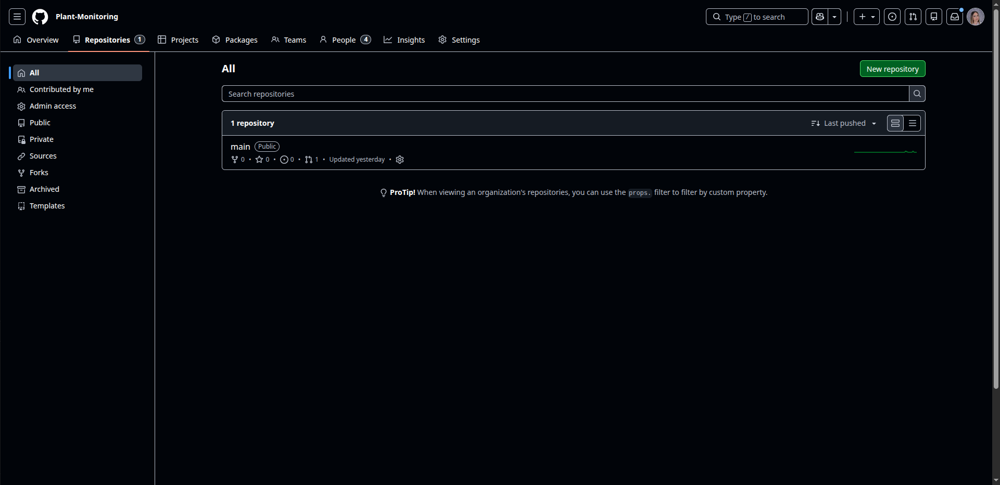
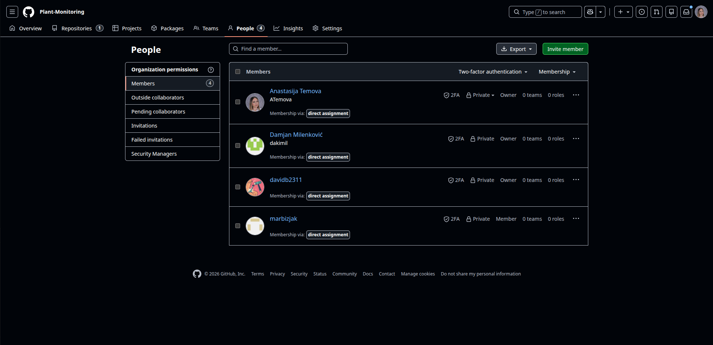
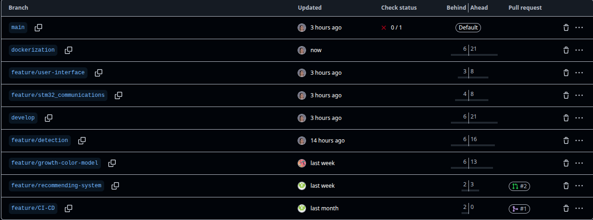
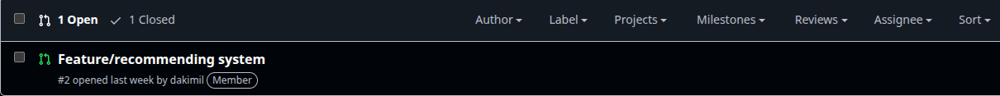
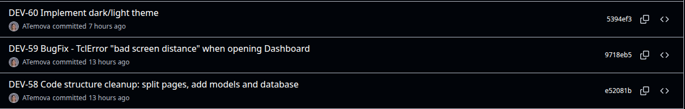
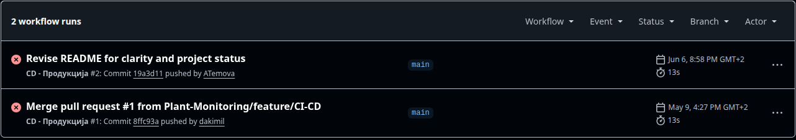

# Sistem za spremljanje in analizo svetlobnih razmer za zdravje rastlin

**Spremljanje programske kode s pomočjo orodja GitHub**

**Skupina:** Anastasija Temova, David Boshevski, Damjan Milenković
**Mentor:** Marko Bizjak

---

## 1. Inicializacija projekta

Za spremljanje in verzioniranje programske kode študentskega projekta smo uporabili spletno orodje GitHub, ki temelji na sistemu za verzioniranje Git. GitHub omogoča centralizirano hranjenje kode, sledenje spremembam, sodelovanje med člani ekipe ter integracijo z orodji za vodenje projekta.

Vsak član mikroskupine je najprej opravil registracijo uporabniškega računa na spletni strani [https://github.com](https://github.com). Po uspešni registraciji je vodja mikroskupine ustvaril nov repozitorij za hranjenje programske kode študentskega projekta, kot je prikazano na Sliki 1.



Repozitorij je bil ustvarjen kot zaseben (**private**), kar pomeni, da je dostopen le povabljenim članom. To zagotavlja varnost kode in nadzor nad dostopom do repozitorija.

Po uspešnem kreiranju repozitorija je vodja mikroskupine v nastavitve repozitorija (**Settings → Collaborators**) dodal vse člane mikroskupine z ustreznimi pravicami, kot je prikazano na Sliki 2:

- **Anastasija Temova** — Write (pravice za pisanje in potrditev kode)
- **David Boshevski** — Write (pravice za pisanje in potrditev kode)
- **Damjan Milenković** — Write (pravice za pisanje in potrditev kode)
- **Marko Bizjak** (mentor) — Read (pregled kode in vodenje poteka vaje)



---

## 2. Gitflow

V repozitoriju sledimo principu Gitflow, ki je uveljavljena metoda za upravljanje z vejami v sistemu Git. Gitflow predpisuje jasno strukturo vej, ki ločuje razvojno delo od stabilne produkcijske kode in olajša vzporeden razvoj več funkcionalnosti hkrati.

### 2.1 Struktura vej

V skladu s principom Gitflow vzdržujemo naslednje veje:

| Veja | Ime veje | Namen |
|---|---|---|
| **Glavna (produkcijska) veja** | `main` | Vsebuje stabilno, produkcijsko kodo. Na to vejo se izvaja združevanje samo iz veje `develop` po uspešnem testiranju. Vlogo produkcijske veje prevzema `main`; ob stabilni različici se na njej ustvari oznaka (tag). |
| **Razvojna veja** | `develop` | Aktivna razvojna veja, kamor se združujejo zaključene funkcionalnosti (feature veje). Osnova za vse razvojne aktivnosti. |
| **Veje za funkcionalnosti** | `feature/ime-funkcionalnosti` | Ločena veja za razvoj vsake posamezne funkcionalnosti. Po zaključku se združi nazaj v vejo `develop`. |

Trenutne veje v repozitoriju:

- `main` — glavna stabilna (produkcijska) veja
- `develop` — aktivna razvojna veja
- `feature/growth-color-model` — razvoj modela za napoved rasti in barve
- `feature/recommending-system` — razvoj priporočilnega sistema
- `feature/stm32_communications` — razvoj komunikacije s senzorji STM32
- `feature/user-interface` — razvoj grafičnega vmesnika
- `feature/CI-CD` — vzpostavitev sprotne integracije

### 2.2 Potek dela z vejami

Potek dela v okviru metodologije Gitflow poteka na naslednji način:

**1. Ustvaritev nove feature veje iz veje develop:**
```bash
git checkout develop
git pull origin develop
git checkout -b feature/ime-funkcionalnosti
```

**2. Redno ustvarjanje potrditev med razvojem:**
```bash
git add .
git commit -m "DEV-12 Dodaj branje intenzitete svetlobe"
git push origin feature/ime-funkcionalnosti
```

**3. Po zaključku razvoja** član ustvari zahtevo za združitev (**Pull Request**) v vejo `develop`. Ostali člani pregledajo kodo, podajo komentarje in po odobritvi se feature veja združi v `develop`, kot je prikazano na Sliki 4.

**4. Po uspešnem testiranju** se veja `develop` združi v vejo `main`, kjer se za stabilno različico ustvari oznaka:
```bash
git checkout main
git merge develop
git tag -a v1.0 -m "Različica 1.0"
```





---

## 3. Integracija z Jiro

Za povezavo med repozitorijem GitHub in sistemom za vodenje projekta Jira smo uporabili integracijo **GitHub for Jira**. Povezava omogoča, da se potrditve (commits) in feature veje samodejno prikažejo pri ustreznem opravilu v Jiri, in sicer na podlagi navedbe ključa opravila v sporočilu potrditve.

Pri vsakem commitu na začetku sporočila navedemo ključ opravila iz Jire (`DEV-<številka>`), ki mu sledi kratek opis spremembe:

```
DEV-<številka> kratek opis spremembe
```

**Primeri dejansko uporabljenih commit sporočil:**
```
DEV-58 Code structure cleanup: split pages, add models and database
DEV-59 BugFix - TclError "bad screen distance" when opening Dashboard
DEV-60 Implement dark/light theme toggle
```

> **Opomba:** Ključ opravila (npr. `DEV-58`) na začetku sporočila omogoča, da integracija GitHub for Jira commit samodejno poveže z ustreznim opravilom v Jiri. Povezane potrditve so vidne v razdelku **Development** posameznega opravila.



---

## 4. Sprotna integracija (CI/CD)

V repozitoriju smo vzpostavili sprotno integracijo (Continuous Integration / Continuous Deployment — CI/CD) s pomočjo orodja GitHub Actions. Sprotna integracija zagotavlja samodejno testiranje in preverjanje kakovosti kode ob vsaki novi potrditvi (commit), kar zmanjšuje tveganje za napake in zagotavlja stabilnost kode.

Konfiguracija se nahaja v datotekah v mapi `.github/workflows/` v korenu repozitorija. Vzpostavili smo dva ločena poteka (workflow):

- **CI — razvojna veja** — samodejno testiranje enot ob vsakem commitu na vejo `develop` in pri Pull Requestih,
- **CD — produkcija** — samodejno prevajanje in objava ob vsakem commitu na vejo `main`.

```yaml
# CI - razvojna veja
name: CI - Development branch
on:
  push:
    branches: [ develop ]
  pull_request:
    branches: [ develop ]

jobs:
  test:
    runs-on: ubuntu-latest
    steps:
      - uses: actions/checkout@v3
      - name: Set up Python
        uses: actions/setup-python@v4
        with:
          python-version: '3.11'
      - name: Install dependencies
        run: pip install -r requirements.txt
      - name: Run tests
        run: pytest tests/ -v
```

Na razvojni veji (`develop`) se ob vsakem commitu samodejno izvedejo testi enot. Na glavni veji (`main`) pa se koda samodejno prevede in objavi. Člani skupine prejmejo e-poštno obvestilo o uspehu ali napaki posameznega koraka.



---

## 5. Zaključek

Z vzpostavitvijo repozitorija na platformi GitHub in uvedbo metodologije Gitflow smo zagotovili strukturirano upravljanje s programsko kodo študentskega projekta. Jasna delitev na veje `main`, `develop` in `feature/*` omogoča vzporeden razvoj funkcionalnosti brez tveganja za nestabilnost produkcijske kode.

Navedba ključev opravil iz Jire v commit sporočilih zagotavlja sledljivost med opravili v sistemu za vodenje projekta in posameznimi potrditvami kode. Vzpostavljena sprotna integracija (CI/CD) z GitHub Actions pa zagotavlja samodejno testiranje in objavo kode, kar zmanjšuje možnost vnosa napak in pospešuje postopek objave novih različic aplikacije.

---

*Zadnja posodobitev: junij 2025*